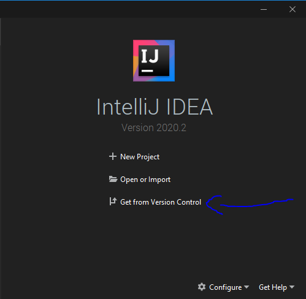

# Lunarbot

lunar jb için yaptığım açık kaynaklı bir bot

# Kullanımı

1 - IntelliJ IDEA indirin ve kurun (https://www.jetbrains.com/idea/download/)

2 - Get from VCS'e tıklayın  

3 - Install Git tuşuna basın

4 - URL bölümüne "https://github.com/thunderstorm010/lunarbot.git" yi yapıştırın

5 - OK'e basın

6 - İşlemin bitmesini bekleyin

